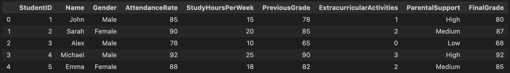
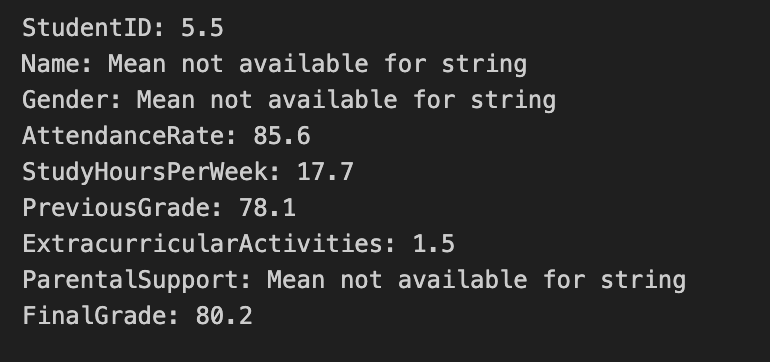
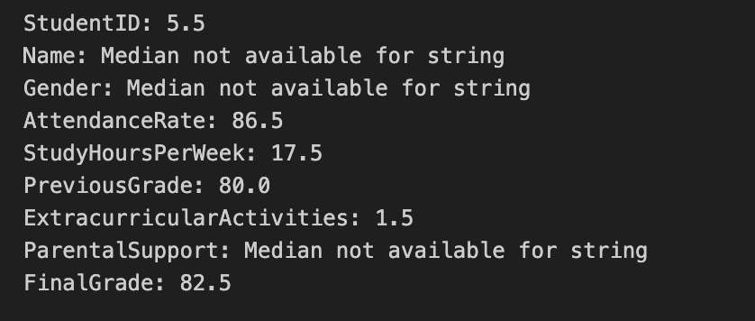
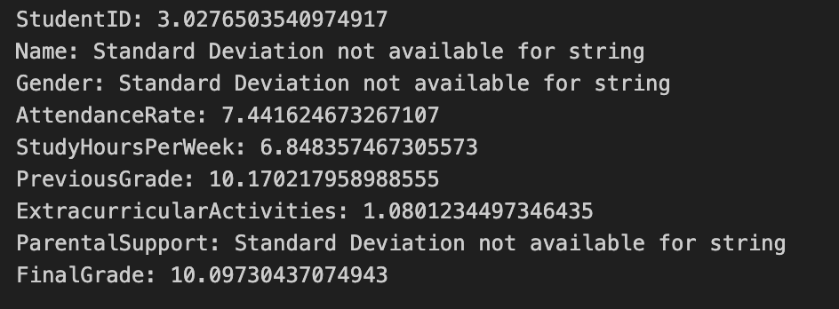
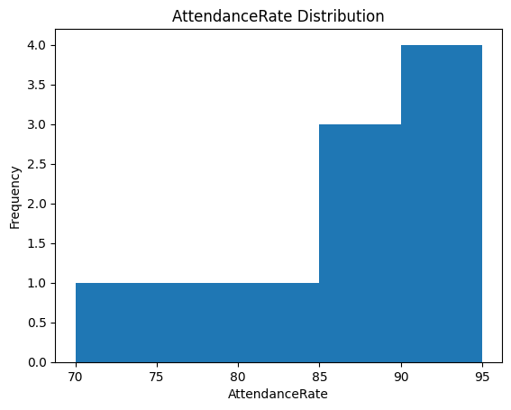
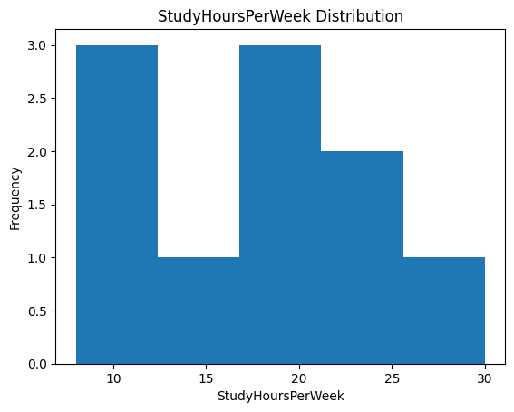

# IDS-706-Data-Engineering Individual Project 1

### Demo Video

[Click Here](https://youtu.be/-TGdicHmuOw)

### About the Data
The data used is about Student Performance from Kaggle. The dataset contains features such as Student ID, Attendance Rate, Study Hours Per Week, Previous Grade, etc.

### Functions

The main Python files in this project are `lib.py` and `script.py`. Below are the functions within each file:

#### **`lib.py`** contains four functions:

1. **`read_data(path)`**: Reads a CSV file from the provided path using Pandas and returns a DataFrame.

Sample Data:

#### **`script.py`** contains the following functions:

1. **`calc_mean(df, colname)`**: Calculates the mean of a specified column in the DataFrame, handling both numeric and non-numeric data.

2. **`calc_median(df, colname)`**: Computes the median of a specified column in the DataFrame.

3. **`calc_sd(df, colname)`**: Computes the standard deviation of the specified column.

4. **`draw(df, colname)`**: Creates a histogram of the specified column using `matplotlib`.

### Testing
The project also includes two test files, `test_lib.py` and `test_script.py`, which use the `pytest` framework to ensure that the functions perform correctly. Tests are executed automatically using GitHub Actions.

- **`test_lib.py`**: Contains test cases for the functions in `lib.py`.
- **`test_script.py`**: Contains test cases for the functions in `script.py`.

The `requirements.txt` includes all necessary dependencies to run the project, including `pytest`, `pytest-cov`, `pandas`, and `matplotlib`

### Summary Statistics

Mean

Median

Standard Deviation

### Sample Data Visualization

